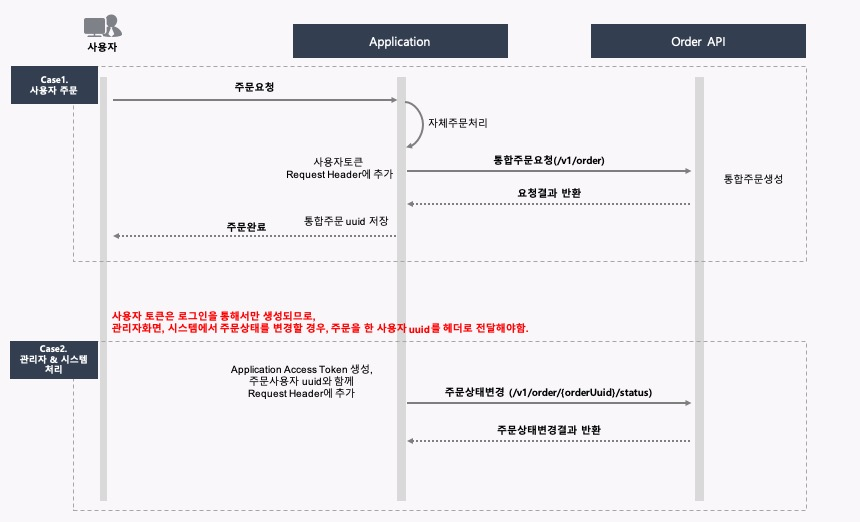

# 주문 API

통합레이어에 주문정보를 등록, 수정, 상태변경하기 위한 API입니다.




## 목차

[1.주문 ID생성 API](#주문-ID생성-API)</br>
[2.주문 등록 API](#주문-등록-API)</br>
[3.주문상태 변경 API](#주문상태-변경-API)</br>
[4.주문 수정 API](#주문-수정-API)</br>
[5.주문 삭제 API](#주문-삭제-API)</br>
[6.반환코드정보](#반환코드정보)</br>


## API 활용 예)

### User Access Token URL

- 사용자가 주문버튼을 클릭 할 경우

- 사용자가 주문취소버튼을 클릭 할 경우 

  

### Application Access Token

- 관리자 페이지에서 주문을 처리 할 경우
- 관리자가 주문을 취소한 경우
- 관리자가 주문상태를 변경할 경우
- 시스템에서 배송상태를 변경 할 때

# 주문 ID생성 API

## Request

##### URL(User Access Token 사용)

```http
POST /v1/order/id HTTP/1.1
Host: dapi.o2obusan.com
Content-type: application/x-www-form-urlencoded;charset=utf-8
```

##### URL(Application Access Token 사용)

```http
POST /v1/client/id HTTP/1.1
Host: dapi.o2obusan.com
Content-type: application/x-www-form-urlencoded;charset=utf-8
```


##### Header

| Name           | Type     | Description                                            | Required |
| :------------- | :------- | :----------------------------------------------------- | :------- |
| AppId          | `String` | 인증서버에서 발급받은 Id                               | O        |
| Authentication | `String` | 토큰 (User Access Token 또는 Application Access Token) | O        |
| UserUuid       | `String` | Application Access Token을 이용할 경우 필수            |          |


##### Parameter

| Name          | Type      | Description                 | Required |
| :------------ | :-------- | :-------------------------- | :------- |
| storeId       | `String`  | 상점ID(가맹점번호)          | O        |
| orderNo       | `String`  | 주문번호                    | O        |
| orderPrice    | `Integer` | 주문금액                    | O        |
| orderDateTime | `String`  | 주문일시 (yyyyMMddHH24miss) | O        |


## Response

| Name          | Type     | Description                 |
| :------------ | :------- | :-------------------------- |
| resultCode    | `String` | 결과코드                    |
| resultMessage | `String` | 결과메시지                  |
| orderUuid     | `String` | 통합주문Id                  |
| storeId       | `String` | 상점ID(가맹점번호)          |
| orderNo       | `String` | 주문번호                    |
| status        | `String` | null 고정                   |
| orderDateTime | `String` | 주문일시 (yyyyMMddHH24miss) |


## Sample

### Request

```shell
curl -v -X POST http://dapi.o2obusan.com/v1/order \
-d 'orderUuid={orderUuid}' \
-d 'storeId={storeId}' \
-d 'storeName={storeName}' \
-d 'orderNo={orderNo}' \
-d 'orderPrice={orderPrice}' \
-d 'orderTitleText={orderTitleText}' \
-d 'orderSubText={orderSubText}' \
-d 'status={status}' \
-d 'imageUrl={imageUrl}' \
-d 'storeUrl={storeUrl}' \
-d 'detailUrl={detailUrl}' \
-d 'deliveryUrl={deliveryUrl}' \
-d 'orderDateTime={orderDateTime}'
```


### Response

```java
HTTP/1.1 200 OK
Content-Type: application/json;charset=UTF-8
{
    "resultCode": "0000",
    "resultMessage": "정상",
    "orderUuid": "xfdadfsa",
    "storeId": "321",
    "storeName": "서울상",
    "orderNo": "20200101",
    "orderPrice": 0,
    "orderTitleText": "상추외 5",
    "orderSubText": null,
    "status": "주문완",
    "imageUrl": null,
    "storeUrl": null,
    "detailUrl": "testets",
    "deliveryUrl": null,
    "orderDateTime": "2021321312321312312"
}
```


### Sample Code

#### Java

```java
String clientId = "dev-shop";
MultiValueMap<String, String> body = new LinkedMultiValueMap<>();
body.add("orderUuid", "ffsadf");
body.add("storeId", "s20000");
body.add("storeName", "스시산");
body.add("orderNo", "xdftdf238drsf");
body.add("orderPrice", "20000");
body.add("orderTitleText", "오늘의회(소)");
body.add("orderSubText", "매운탕추가(2,000원)");
body.add("status", "주문접수대기");
body.add("imageUrl", "https://busancdn.o2obusan.com/images/duy3nb239.jpg");
body.add("storeUrl", "https://market.o2obusan.com/s20000");
body.add("detailUrl", "https://market.o2obusan.com/orders?orderId=xdftdf238drsf");
body.add("deliveryUrl", "https://market.o2obusan.com/delivery?orderId=xdftdf238drsf");
body.add("orderDateTime", "20210128173028");

HttpHeaders headers = new HttpHeaders();
headers.add("Authorization", String.format("Bearer %s", token));
headers.add("AppId", clientId)

HttpEntity httpEntity = new HttpEntity(body, headers);
RestTemplate restTemplate = new RestTemplate();

ResponseEntity<GatewayOrder> result = restTemplate.postForEntity("/v1/order", httpEntity, GatewayOrder.class);
```


# 주문 등록 API

## Request

##### URL(User Access Token 사용)

```http
POST /v1/order HTTP/1.1
Host: dapi.o2obusan.com
Content-type: application/x-www-form-urlencoded;charset=utf-8
```

##### URL(Application Access Token 사용)

```http
POST /v1/client/order HTTP/1.1
Host: dapi.o2obusan.com
Content-type: application/x-www-form-urlencoded;charset=utf-8
```


##### Header

| Name           | Type     | Description                                            | Required |
| :------------- | :------- | :----------------------------------------------------- | :------- |
| AppId          | `String` | 인증서버에서 발급받은 Id                               | O        |
| Authentication | `String` | 토큰 (User Access Token 또는 Application Access Token) | O        |
| UserUuid       | `String` | Application Access Token을 이용할 경우 필수            |          |


##### Parameter

| Name           | Type      | Description                                               | Required |
| :------------- | :-------- | :-------------------------------------------------------- | :------- |
| storeId        | `String`  | 상점ID(가맹점번호)                                        | O        |
| storeName      | `String`  | 상점이름                                                  | O        |
| orderNo        | `String`  | 주문번호                                                  | O        |
| orderPrice     | `Integer` | 주문금액                                                  | O        |
| orderTitleText | `String`  | 주문타이틀 (예: 반반치킨외 1개 23,500원)                  | O        |
| orderSubText   | `String`  | 주문보조타이틀 (옵션 텍스트 표시, 예: 콜라외 2개 5,000원) |          |
| status         | `String`  | 주문상태 Text (주문완료, 주문접수등등 텍스트로 전송)      | O        |
| imageUrl       | `String`  | 대표이미지 URL                                            |          |
| storeUrl       | `String`  | 상점페이지이동 URL                                        |          |
| detailUrl      | `String`  | 주문 상세페이지 URL                                       | O        |
| deliveryUrl    | `String`  | 배송상세페이지 URL                                        |          |
| orderDateTime  | `String`  | 주문일시 (yyyyMMddHH24miss)                               | O        |


## Response

| Name      | Type     | Description  |
| :-------- | :------- | :----------- |
| resultCode     | `String`  | 결과코드                                                  |
| resultMessage  | `String`  | 결과메시지                                                |
| orderUuid | `String` | 공통주문번호 |
| storeId        | `String`  | 상점ID(가맹점번호)                                        |
| storeName      | `String`  | 상점이름                                                  |
| orderNo        | `String`  | 주문번호                                                  |
| orderPrice     | `Integer` | 주문금액                                                  |
| orderTitleText | `String`  | 주문타이틀 (예: 반반치킨외 1개 23,500원)                  |
| orderSubText   | `String`  | 주문보조타이틀 (옵션 텍스트 표시, 예: 콜라외 2개 5,000원) |
| status         | `String`  | 주문상태 Text (주문완료, 주문접수등등 텍스트로 전송)      |
| imageUrl       | `String`  | 대표이미지 URL                                            |
| storeUrl       | `String`  | 상점페이지이동 URL                                        |
| detailUrl      | `String`  | 주문 상세페이지 URL                                       |
| deliveryUrl    | `String`  | 배송상세페이지 URL                                        |
| orderDateTime  | `String`  | 주문일시 (yyyyMMddHH24miss)                               |


## Sample

### Request

```shell
curl -v -X POST http://dapi.o2obusan.com/v1/order \
-d 'storeId={storeId}' \
-d 'storeName={storeName}' \
-d 'orderNo={orderNo}' \
-d 'orderPrice={orderPrice}' \
-d 'orderTitleText={orderTitleText}' \
-d 'orderSubText={orderSubText}' \
-d 'status={status}' \
-d 'imageUrl={imageUrl}' \
-d 'storeUrl={storeUrl}' \
-d 'detailUrl={detailUrl}' \
-d 'deliveryUrl={deliveryUrl}' \
-d 'orderDateTime={orderDateTime}'
```


### Response

```java
HTTP/1.1 200 OK
Content-Type: application/json;charset=UTF-8
{
    "resultCode": "0000",
    "resultMessage": "정상",
    "orderUuid": null,
    "storeId": "321",
    "storeName": "서울상",
    "orderNo": "20200101",
    "orderPrice": 0,
    "orderTitleText": "상추외 5",
    "orderSubText": null,
    "status": "주문완",
    "imageUrl": null,
    "storeUrl": null,
    "detailUrl": "testets",
    "deliveryUrl": null,
    "orderDateTime": "2021321312321312312"
}
```


### Sample Code

#### Java

```java
String clientId = "dev-shop";
MultiValueMap<String, String> body = new LinkedMultiValueMap<>();
body.add("storeId", "s20000");
body.add("storeName", "스시산");
body.add("orderNo", "xdftdf238drsf");
body.add("orderPrice", "20000");
body.add("orderTitleText", "오늘의회(소)");
body.add("orderSubText", "매운탕추가(2,000원)");
body.add("status", "주문접수대기");
body.add("imageUrl", "https://busancdn.o2obusan.com/images/duy3nb239.jpg");
body.add("storeUrl", "https://market.o2obusan.com/s20000");
body.add("detailUrl", "https://market.o2obusan.com/orders?orderId=xdftdf238drsf");
body.add("deliveryUrl", "https://market.o2obusan.com/delivery?orderId=xdftdf238drsf");
body.add("orderDateTime", "20210128173028");

HttpHeaders headers = new HttpHeaders();
headers.add("Authorization", String.format("Bearer %s", token));
headers.add("AppId", clientId)

HttpEntity httpEntity = new HttpEntity(body, headers);
RestTemplate restTemplate = new RestTemplate();

ResponseEntity<GatewayOrder> result = restTemplate.postForEntity("/v1/order", httpEntity, GatewayOrder.class);
```


# 주문 상태변경 API

## Request

##### URL(User Access Token 사용)

```http
PUT /v1/order/{orderUuid}/status HTTP/1.1
Host: dapi.o2obusan.com
Content-type: application/x-www-form-urlencoded;charset=utf-8
```

##### URL(Application Access Token 사용)

```http
PUT /v1/client/order/{orderUuid}/status HTTP/1.1
Host: dapi.o2obusan.com
Content-type: application/x-www-form-urlencoded;charset=utf-8
```

##### Header

| Name           | Type     | Description                                            | Required |
| :------------- | :------- | :----------------------------------------------------- | :------- |
| AppId          | `String` | 인증서버에서 발급받은 Id                               | O        |
| Authentication | `String` | 토큰 (User Access Token 또는 Application Access Token) | O        |
| UserUuid       | `String` | Application Access Token을 이용할 경우 필수            |          |


##### Parameter

| Name   | Type     | Description                                          | Required |
| :----- | :------- | :--------------------------------------------------- | :------- |
| status | `String` | 주문상태 Text (주문완료, 주문접수등등 텍스트로 전송) | O        |


## Response

| Name          | Type     | Description                 |
| :------------ | :------- | :-------------------------- |
| resultCode    | `String` | 결과코드                    |
| resultMessage | `String` | 결과메시지                  |
| orderUuid     | `String` | 통합주문Id                  |
| storeId       | `String` | 상점ID(가맹점번호)          |
| orderNo       | `String` | 주문번호                    |
| status        | `String` | 주문상태 Text               |
| orderDateTime | `String` | 주문일시 (yyyyMMddHH24miss) |


## Sample

### Request

```shell
curl -v -X POST http://dapi.o2obusan.com/v1/order/{orderUuid}/status \
-d 'status={status}'
```


### Response

```java
HTTP/1.1 200 OK
Content-Type: application/json;charset=UTF-8
{
    "resultCode": "0000",
    "resultMessage": "정상",
    "orderUuid": "fdsfasf",
    "storeId": "dsjdfye231",
    "orderNo": "test",
    "status": "배송시작",
    "orderDateTime": "Fdasfsa"
}
```


### Sample Code

#### Java

```java
String clientId = "dev-shop";
MultiValueMap<String, String> body = new LinkedMultiValueMap<>();
body.add("status", "배송시작");

HttpHeaders headers = new HttpHeaders();
headers.add("Authorization", String.format("Bearer %s", token));
headers.add("AppId", clientId)

HttpEntity httpEntity = new HttpEntity(body, headers);
RestTemplate restTemplate = new RestTemplate();

ResponseEntity<GatewayOrder> result = restTemplate.putForEntity("/v1/order/eyJhbGci3Bo/status", httpEntity, GatewayOrder.class);
```

# 주문 수정 API

## Request

##### URL(User Access Token 사용)

```http
PUT /v1/order HTTP/1.1
Host: dapi.o2obusan.com
Content-type: application/x-www-form-urlencoded;charset=utf-8
```

##### URL(Application Access Token 사용)

```http
PUT /v1/client/order HTTP/1.1
Host: dapi.o2obusan.com
Content-type: application/x-www-form-urlencoded;charset=utf-8
```

##### Header

| Name           | Type     | Description                                            | Required |
| :------------- | :------- | :----------------------------------------------------- | :------- |
| AppId          | `String` | 인증서버에서 발급받은 Id                               | O        |
| Authentication | `String` | 토큰 (User Access Token 또는 Application Access Token) | O        |
| UserUuid       | `String` | Application Access Token을 이용할 경우 필수            |          |


##### Parameter

| Name           | Type      | Description                                               | Required |
| :------------- | :-------- | :-------------------------------------------------------- | :------- |
| storeId        | `String`  | 상점ID(가맹점번호)                                        | O        |
| storeName      | `String`  | 상점이름                                                  | O        |
| orderNo        | `String`  | 주문번호                                                  | O        |
| orderPrice     | `Integer` | 주문금액                                                  | O        |
| orderTitleText | `String`  | 주문타이틀 (예: 반반치킨외 1개 23,500원)                  | O        |
| orderSubText   | `String`  | 주문보조타이틀 (옵션 텍스트 표시, 예: 콜라외 2개 5,000원) |          |
| status         | `String`  | 주문상태 Text (주문완료, 주문접수등등 텍스트로 전송)      | O        |
| imageUrl       | `String`  | 대표이미지 URL                                            |          |
| storeUrl       | `String`  | 상점페이지이동 URL                                        |          |
| detailUrl      | `String`  | 주문 상세페이지 URL                                       | O        |
| deliveryUrl    | `String`  | 배송상세페이지 URL                                        |          |
| orderDateTime  | `String`  | 주문일시 (yyyyMMddHH24miss)                               | O        |


## Response

| Name           | Type      | Description                                               |
| :------------- | :-------- | :-------------------------------------------------------- |
| resultCode     | `String`  | 결과코드                                                  |
| resultMessage  | `String`  | 결과메시지                                                |
| orderUuid      | `String`  | 공통주문번호                                              |
| storeId        | `String`  | 상점ID(가맹점번호)                                        |
| storeName      | `String`  | 상점이름                                                  |
| orderNo        | `String`  | 주문번호                                                  |
| orderPrice     | `Integer` | 주문금액                                                  |
| orderTitleText | `String`  | 주문타이틀 (예: 반반치킨외 1개 23,500원)                  |
| orderSubText   | `String`  | 주문보조타이틀 (옵션 텍스트 표시, 예: 콜라외 2개 5,000원) |
| status         | `String`  | 주문상태 Text (주문완료, 주문접수등등 텍스트로 전송)      |
| imageUrl       | `String`  | 대표이미지 URL                                            |
| storeUrl       | `String`  | 상점페이지이동 URL                                        |
| detailUrl      | `String`  | 주문 상세페이지 URL                                       |
| deliveryUrl    | `String`  | 배송상세페이지 URL                                        |
| orderDateTime  | `String`  | 주문일시 (yyyyMMddHH24miss)                               |


## Sample

### Request

```shell
curl -v -X POST http://dapi.o2obusan.com/v1/order \
-d 'storeId={storeId}' \
-d 'storeName={storeName}' \
-d 'orderNo={orderNo}' \
-d 'orderPrice={orderPrice}' \
-d 'orderTitleText={orderTitleText}' \
-d 'orderSubText={orderSubText}' \
-d 'status={status}' \
-d 'imageUrl={imageUrl}' \
-d 'storeUrl={storeUrl}' \
-d 'detailUrl={detailUrl}' \
-d 'deliveryUrl={deliveryUrl}' \
-d 'orderDateTime={orderDateTime}'
```


### Response

```java
HTTP/1.1 200 OK
Content-Type: application/json;charset=UTF-8
{
    "resultCode": "0000",
    "resultMessage": "정상",
    "orderUuid": null,
    "storeId": "321",
    "storeName": "서울상",
    "orderNo": "20200101",
    "orderPrice": 0,
    "orderTitleText": "상추외 5",
    "orderSubText": null,
    "status": "주문완",
    "imageUrl": null,
    "storeUrl": null,
    "detailUrl": "testets",
    "deliveryUrl": null,
    "orderDateTime": "2021321312321312312"
}
```


### Sample Code

#### Java

```java
String clientId = "dev-shop";
MultiValueMap<String, String> body = new LinkedMultiValueMap<>();
body.add("storeId", "s20000");
body.add("storeName", "스시산");
body.add("orderNo", "xdftdf238drsf");
body.add("orderPrice", "20000");
body.add("orderTitleText", "오늘의회(소)");
body.add("orderSubText", "매운탕추가(2,000원)");
body.add("status", "주문접수대기");
body.add("imageUrl", "https://busancdn.o2obusan.com/images/duy3nb239.jpg");
body.add("storeUrl", "https://market.o2obusan.com/s20000");
body.add("detailUrl", "https://market.o2obusan.com/orders?orderId=xdftdf238drsf");
body.add("deliveryUrl", "https://market.o2obusan.com/delivery?orderId=xdftdf238drsf");
body.add("orderDateTime", "20210128173028");

HttpHeaders headers = new HttpHeaders();
headers.add("Authorization", String.format("Bearer %s", token));
headers.add("AppId", clientId)

HttpEntity httpEntity = new HttpEntity(body, headers);
RestTemplate restTemplate = new RestTemplate();

ResponseEntity<GatewayOrder> result = restTemplate.putForEntity("/v1/order/{eyJhbGci3Bo}", httpEntity, GatewayOrder.class);
```

# 주문 삭제 API

## Request

##### URL(User Access Token 사용)

```http
DELETE /v1/order/{orderUuid} HTTP/1.1
Host: dapi.o2obusan.com
Content-type: application/x-www-form-urlencoded;charset=utf-8
```

##### URL(Application Access Token 사용)

```http
DELETE /v1/client/order/{orderUuid} HTTP/1.1
Host: dapi.o2obusan.com
Content-type: application/x-www-form-urlencoded;charset=utf-8
```

##### Header

| Name           | Type     | Description                                            | Required |
| :------------- | :------- | :----------------------------------------------------- | :------- |
| AppId          | `String` | 인증서버에서 발급받은 Id                               | O        |
| Authentication | `String` | 토큰 (User Access Token 또는 Application Access Token) | O        |
| UserUuid       | `String` | Application Access Token을 이용할 경우 필수            |          |


## Response

| Name          | Type     | Description                 |
| :------------ | :------- | :-------------------------- |
| resultCode    | `String` | 결과코드                    |
| resultMessage | `String` | 결과메시지                  |
| orderUuid     | `String` | 통합주문Id                  |
| storeId       | `String` | 상점ID(가맹점번호)          |
| orderNo       | `String` | 주문번호                    |
| status        | `String` | 주문상태 Text               |
| orderDateTime | `String` | 주문일시 (yyyyMMddHH24miss) |


## Sample

### Request

```shell
curl -v -X DELTE http://dapi.o2obusan.com/v1/order/{orderUuid}
```


### Response

```java
HTTP/1.1 200 OK
Content-Type: application/json;charset=UTF-8
{
    "resultCode": "0000",
    "resultMessage": "정상",
    "orderUuid": "fdsfasf",
    "storeId": "dsjdfye231",
    "orderNo": "test",
    "status": "",
    "orderDateTime": "20210101010122"
}
```


### Sample Code

#### Java

```java
String clientId = "dev-shop";

HttpHeaders headers = new HttpHeaders();
headers.add("Authorization", String.format("Bearer %s", token));
headers.add("AppId", clientId)

HttpEntity httpEntity = new HttpEntity( headers);
RestTemplate restTemplate = new RestTemplate();

ResponseEntity<GatewayOrder> result = restTemplate.deleteForEntity("/v1/order/eyJhbGci3Bo", httpEntity, GatewayOrder.class);
```


# 반환코드정보

| http status | resultCode | resultMessage |
| :------------ | :------- | :-------------------------- |
| 200 | 0000 | 정상 |
| 400 | 1000 | 상점아이디가 올바르지 않습니다. |
| 400 | 1001 | 상점명이 올바르지 않습니다. |
| 400 | 1002 | 주문번호가 올바르지 않습니다. |
| 400 | 1003 | 주문금액이 올바르지 않습니다. |
| 400 | 1004 | 주문타이틀이 올바르지 않습니다. |
| 400 | 1005 | 주문상태가 올바르지 않습니다. |
| 400 | 1006 | 상세페이지 주소가 올바르지 않습니다. |
| 400 | 1007 | 주문시간이 올바르지 않습니다. |
| 400 | 1008 | 상태텍스트가 누락되었습니다. |
| 400 | 1009 | 일치하는 주문이 없습니다. |
| 400 | 1010 | 주문ID가 올바르지 않습니다. |
| 400 | 1011 | 일치하는 주문ID가 없습니다. |